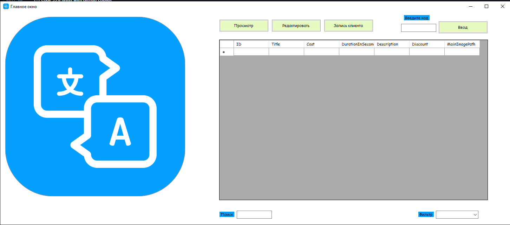

# Введение

Приложение представляет из себя подсистему для работы с услугами компании, которая должна включает в себя следующий функционал: 
*просмотр списка услуг,
*добавление/удаление/редактирование данных об услугах, 
* работа с дополнительными изображениями к услугам, 
* запись клиента на услугу, 
* управление ближайшими записями на услуги школы иностранных языков

## Начало работы

Эти инструкции предоставят вам копию проекта и помогут запустить на вашем локальном компьютере для разработки и тестирования.

### Необходимые условия

Убедитесь что компьютер соответсвует минимальным системным требованиям:
*Процессор Celeron G6330
*Оперативная память 2гб
*Операционная система Windows 10
*Поддерживается клавиатура и мышь

### Установка и запуск

1)Скачайте программу
2)Запустите с помощью "школа языков «Леарн».exe"

После загрузки приложения вы увидите главную страницу на которой находится логотип школы иностранных языков а так же кнопки управления программой.

Для того чтобы зайти как администратор, необходимо ввести код в поле которое находится под надписью "введите код", и нажмите кнопку "Ввод", после этого вам откроются функции администратора,такие как: "Просмотр","Редактировать","Запись клиента".

## Авторы

Шеф Иван ИП213
